# NexAround — Complete Platform Architecture & System Specifications

This document serves as the master authority on the architecture, technical specs, database schemas, and deployment setup for the **NexAround** smart tourism platform. It is designed to be accessible to project managers, business stakeholders, and developers alike.

---

## 🗺️ 1. High-Level Architectural Flow

NexAround uses a client-server architecture. To prevent resource abuse and secure third-party API keys, all client devices speak only with a central server, which queries external APIs (like Gemini AI, Google Maps, and Mapbox) securely and caches expensive search queries.

### Visual Architecture Diagram
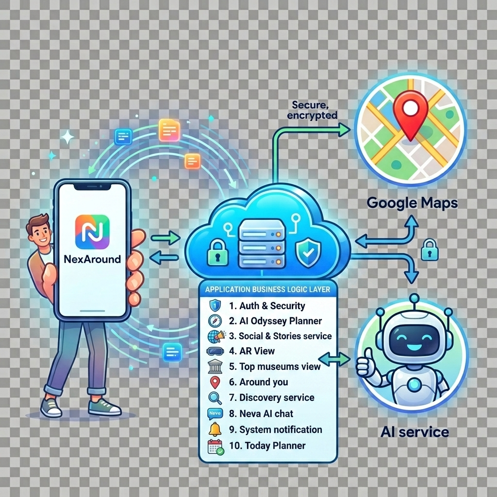

### System Component Handshake (Mermaid Diagram)
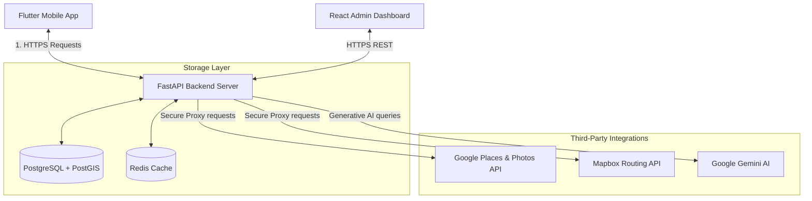

---

## 📱 2. Mobile Client Architecture (`nexaround_app`)

The mobile client is built using **Flutter (Dart)** and follows **Clean Architecture** patterns combined with the **BLoC** (Business Logic Component) state management pattern.

```
          ┌─────────────────────────────────────────────────────────┐
          │                   Presentation Layer                    │
          │         [Widgets / UI Pages] ◄──► [BLoCs / States]      │
          └────────────────────────────┬────────────────────────────┘
                                       │
                                       ▼
          ┌─────────────────────────────────────────────────────────┐
          │                      Domain Layer                       │
          │    [Entities] ◄── [Use Cases] ◄── [Repository Interface]│
          └────────────────────────────┬────────────────────────────┘
                                       │
                                       ▼
          ┌─────────────────────────────────────────────────────────┐
          │                       Data Layer                        │
          │   [Models] ◄── [Repository Impl] ◄── [Datasources]       │
          └─────────────────────────────────────────────────────────┘
```

### Module File Layout
Each app feature (e.g., `living_map`, `auth`, `attractions`, `budget`) is split into three independent layers:
*   **Domain Layer**:
    *   **Entities**: Pure Dart model classes defining the core data model.
    *   **Use Cases**: Handles feature-specific workflows (e.g., `fetch_nearby_places_usecase`).
    *   **Repository Interfaces**: Abstract contracts defining required operations.
*   **Data Layer**:
    *   **Models**: Extends entities to provide serialization/deserialization helpers (`fromJson`, `toJson`).
    *   **Repository Implementations**: Fulfills the domain repository contract by coordinating network calls.
    *   **Datasources**: Handles low-level I/O operations (e.g., REST API calls via Dio, local storage using SharedPreferences).
*   **Presentation Layer**:
    *   **BLoCs**: Manages business logic and updates the view by mapping incoming `Events` to new `States`.
    *   **Pages & Widgets**: Renders the UI and triggers `Events` when users interact with the screen.

### Dependency Stack
*   **State Management**: `flutter_bloc`
*   **Navigation / Routing**: `go_router`
*   **Network Client**: `dio` (with global retry, SSL pinning, and API interceptors)
*   **Dependency Injection**: `get_it` & `injectable`

---

## ⚡ 3. Backend Service Architecture (`nexaround_backend`)

The backend is built with **FastAPI (Python)**. It acts as an API gateway, secure key proxy, database coordinator, and geospatial query engine.

### Code Organization
*   **`app/api/`**: API endpoint routers grouped under `/v1` (e.g., `auth.py`, `places.py`, `proxy.py`).
*   **`app/services/`**: Houses the core logic for Google Places geocoding, Gemini AI formatting, map indexing, and currency converters.
*   **`app/models/`**: Defines SQLAlchemy database tables mapping Python objects to PostgreSQL.
*   **`app/schemas/`**: Pydantic validation schemas defining incoming payload requirements and outgoing serialization models.
*   **`app/core/`**: Configuration, database pooling (`async_session`), security headers, and settings.

### Technology Stack
*   **Framework**: FastAPI & Uvicorn (Asynchronous ASGI server).
*   **Database Interface**: SQLAlchemy with dynamic async support (`asyncpg`) and **GeoAlchemy2** for PostGIS coordinate operations.
*   **Caching**: Redis (manages coordinate-based grids and keeps resolved maps in memory with custom TTL expirations).
*   **AI Integration**: Official Google GenAI SDK (Gemini-2.5-flash & Gemini-1.5-flash models).

---


## 🔄 5. End-to-End Operational Workflows

To ensure a cohesive understanding of how the client and server interact for each core feature, the following sections outline the detailed operational workflows, the exact API endpoints used (along with HTTP methods, request payloads, and response structures), the **external API keys used**, and their respective sequence diagrams.

### 1. User Onboarding & Authentication (`auth`)
*   **Overview**: Manages traveler registration, secure credentials authentication (using bcrypt hashing server-side), profile retrieval, and updating user preferences (e.g., travel language, default currency).
*   **API Endpoints**:
    *   `POST /api/v1/auth/register`: Register a new user account.
        *   *Request*: `UserRegister` JSON payload containing `email`, `password`, `display_name`.
        *   *Response*: `TokenResponse` JSON containing `access_token`, `refresh_token`, `token_type` (Bearer).
    *   `POST /api/v1/auth/login`: Authenticate existing user.
        *   *Request*: `UserLogin` JSON payload containing `email`, `password`.
        *   *Response*: `TokenResponse` JSON containing `access_token`, `refresh_token`, `token_type`.
    *   `GET /api/v1/auth/me`: Retrieve current authenticated profile.
        *   *Headers*: `Authorization: Bearer <JWT_ACCESS_TOKEN>`
        *   *Response*: `UserResponse` JSON containing user's profile metadata and preferences.
    *   `PUT /api/v1/auth/me/preferences`: Update preferences.
        *   *Headers*: `Authorization: Bearer <JWT_ACCESS_TOKEN>`
        *   *Request*: `UserPreferencesUpdate` JSON containing `preferences` dictionary (e.g., `{"currency": "USD"}`).
        *   *Response*: `UserResponse` JSON with updated preferences.
*   **API Keys & External Services Used**: None (strictly handled internally using the PostgreSQL database and JWT token generation). *Note: Optional Firebase configuration keys are supported for FCM push tokens.*

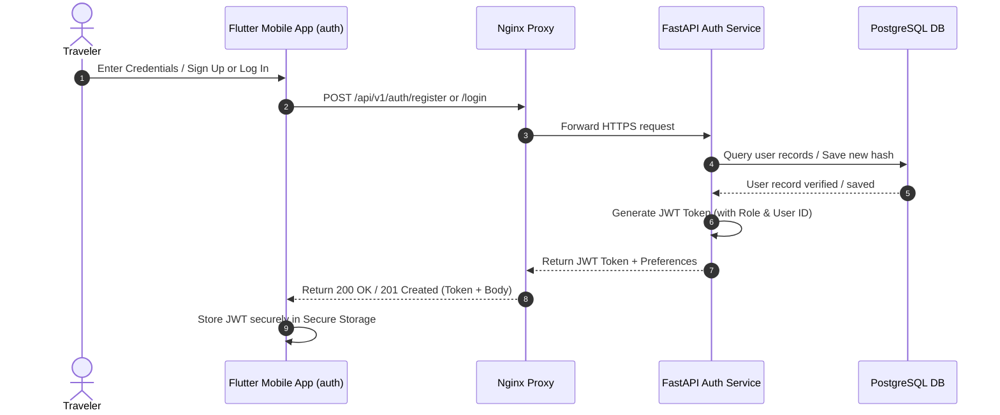

### 2. AI Odyssey Itinerary Generation (`itinerary`)
*   **Overview**: Enables travelers to request custom, multi-day, budget-aligned travel itineraries. The generation is handled asynchronously via backend background tasks to keep the mobile UI responsive.
*   **API Endpoints**:
    *   `POST /api/v1/itineraries/odyssey/generate`: Trigger itinerary generation.
        *   *Headers*: `Authorization: Bearer <JWT_ACCESS_TOKEN>`
        *   *Request*: `OdysseyGenerateRequest` JSON containing `destination`, `mood`, `budget`, `days`, `currency`, `travelers`, `include_flights`, `include_hotels`.
        *   *Response*: Returns `202 Accepted` status with an itinerary placeholder object (`status: "generating"`).
    *   `GET /api/v1/itineraries/{id}`: Poll status or retrieve completed itinerary.
        *   *Headers*: `Authorization: Bearer <JWT_ACCESS_TOKEN>`
        *   *Response*: `ItineraryResponse` JSON containing status (`generating`, `active`, `failed`), title, and a structured array of daily itinerary items (flights, hotels, activities).
*   **API Keys & External Services Used**:
    *   **Google Gemini API Key (`gemini_api_key`)**: Used by the backend background task via the Google GenAI SDK (models: `gemini-2.5-flash`, `gemini-1.5-pro` as fallback) to generate day-by-day structured itinerary JSON plans.

```mermaid
sequenceDiagram
    autonumber
    actor User as Traveler
    participant App as Flutter Mobile App (itinerary)
    participant API as FastAPI Router
    participant DB as PostgreSQL DB
    participant BG as Background Task Worker
    participant Gemini as Google Gemini AI

    User->>App: Request trip (Destination, Mood, Budget, Days)
    App->>API: POST /api/v1/itineraries/odyssey/generate (JWT)
    API->>DB: Save placeholder Itinerary (status: 'generating')
    DB-->>API: Saved Itinerary ID
    API->>BG: Spawn background task (_run_odyssey_generation)
    API-->>App: Return HTTP 202 Accepted (Itinerary ID)
    Note over App: Mobile App starts polling status & shows spinner

    BG->>Gemini: Request AI generation (itinerary details)
    Gemini-->>BG: Return structured JSON plan
    BG->>DB: Update Itinerary status to 'active' + insert items
    DB-->>BG: Update confirmed

    loop Polling Status
        App->>API: GET /api/v1/itineraries/{id}
        API->>DB: Fetch itinerary status
        DB-->>API: Return status (generating or active)
        API-->>App: Return status payload
    end
    Note over App: Status changes to active; displays itinerary
```

### 3. Living Map & Nearby Discovery (`living_map`)
*   **Overview**: Renders an interactive map centered on the user's coordinates, fetching and plotting nearby points of interest (attractions, restaurants, parks) from Google Places, cached via server-side Redis to minimize third-party API costs.
*   **API Endpoints**:
    *   `GET /api/v1/places/nearby`: Fetch location-based attractions.
        *   *Request Params*: `lat` (float), `lng` (float), `category` (string, optional), `radius` (int, default 5000).
        *   *Response*: `PlacesNearbyResponse` JSON containing a list of matching attraction nodes (name, coordinates, rating, address, photo references).
    *   `GET /api/v1/places/search`: Search by text query.
        *   *Request Params*: `query` (string), `lat` (float), `lng` (float).
        *   *Response*: `PlacesNearbyResponse` JSON with matched location results.
    *   `GET /api/v1/places/photo`: Stream attraction imagery.
        *   *Request Params*: `ref` (string, Google photo reference), `maxwidth` (int, default 800).
        *   *Response*: Returns the binary image payload (JPEG).
*   **API Keys & External Services Used**:
    *   **Google Maps API Key (`google_maps_api_key`)**: Attached at the server level by the proxy service to authorize Google Places API searches and photo reference streams.
    *   **Mapbox Access Token (`mapbox_access_token`)**: Requested by the client map components via `/config/keys` to load Mapbox style layers and render coordinates on-screen.

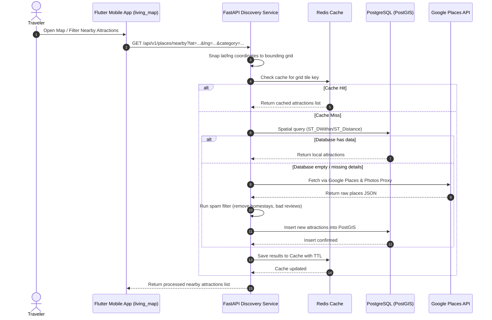

### 4. AR Mode & Live Landmark Identification (`ar_mode`)
*   **Overview**: Uses the device camera viewport to capture image frames. Frames are uploaded to the backend to identify local landmarks and display augmented reality overlays in real-time.
*   **API Endpoints**:
    *   `POST /api/v1/ar/identify`: Send camera frames for live AI analysis.
        *   *Headers*: `Authorization: Bearer <JWT_ACCESS_TOKEN>`
        *   *Request*: Multipart form-data containing the raw image frame `file`.
        *   *Response*: JSON object containing identified landmarks, confidence ratings, and descriptive text/historical summaries.
*   **API Keys & External Services Used**:
    *   **Google Gemini API Key (`gemini_api_key`)**: Authorized on the backend to process raw image bytes via vision models (`gemini-2.5-flash`) for real-time landmark recognition.
    *   **Google Lens / Custom Search API**: Used optionally within the backend `google_lens_service` to fall back on web visual searches when identification confidence is low.

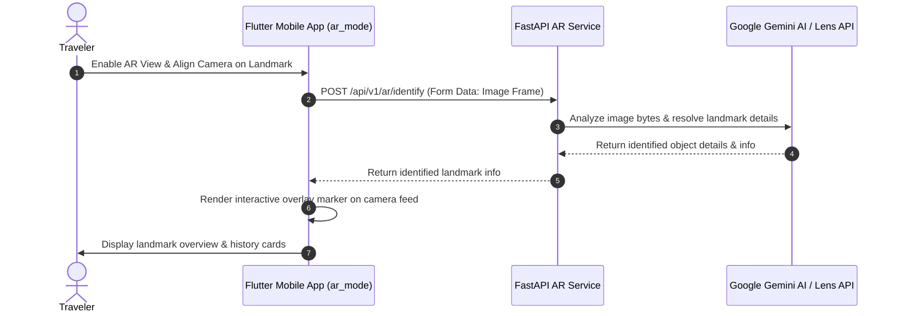

### 5. AR Museum Guide & Building Masterpieces (`mini_tour` / `museums`)
*   **Overview**: Serves curated tour paths and masterpiece maps for world-class museums, including indoor floor mappings, audio guide feeds, and walking navigation paths.
*   **API Endpoints**:
    *   `GET /api/v1/museums/`: List all supported museums.
        *   *Response*: List of `MuseumListItem` objects (ID, slug, name, city, annual visitors, masterpiece count).
    *   `GET /api/v1/museums/{slug}`: Retrieve specific museum details.
        *   *Response*: `MuseumDetail` JSON showing full masterpiece logs, floors, and location meta.
    *   `GET /api/v1/museums/{slug}/itinerary`: Fetch walking itineraries.
        *   *Request Params*: `duration` (string: 3h, 5h, 1d, 2d).
        *   *Response*: `MuseumItinerary` JSON containing a list of buildings and masterpiece sections ordered for an optimal walking route.
*   **API Keys & External Services Used**: None (all museum coordinates, floor definitions, itineraries, and media resource URLs are stored locally in the PostgreSQL database).

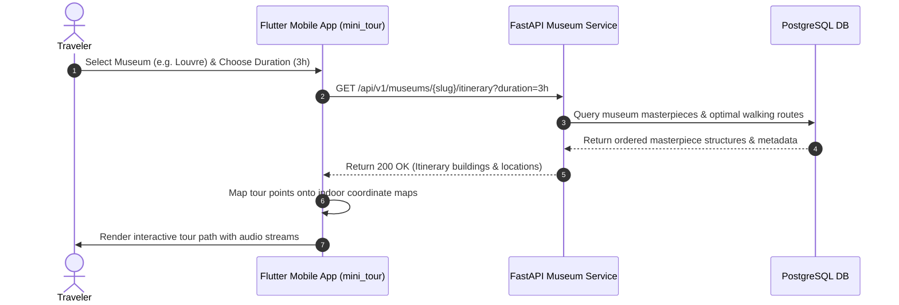

### 6. Community Travel Feed & Stories (`travel_stories` / public)
*   **Overview**: Allows travelers to browse, search, like, and comment on public travel journals shared by other users globally, creating a social travel network.
*   **API Endpoints**:
    *   `GET /api/v1/travel-stories`: Retrieve public travel stories.
        *   *Headers*: `Authorization: Bearer <JWT_ACCESS_TOKEN>`
        *   *Request Params*: `country` (string, optional).
        *   *Response*: Array of `TravelStoryResponse` JSON (id, description, user info, likes count, comments list, image URLs).
    *   `POST /api/v1/travel-stories/{story_id}/like`: Toggle like on a story.
        *   *Headers*: `Authorization: Bearer <JWT_ACCESS_TOKEN>`
        *   *Response*: Status code `200 OK`.
    *   `POST /api/v1/travel-stories/{story_id}/comment`: Post a comment.
        *   *Headers*: `Authorization: Bearer <JWT_ACCESS_TOKEN>`
        *   *Request*: `TravelStoryCommentCreate` JSON containing `comment_text` and `image_index` (optional).
        *   *Response*: `TravelStoryCommentResponse` detailing the created comment.
*   **API Keys & External Services Used**: None (data is stored and processed locally within the PostgreSQL relational database).

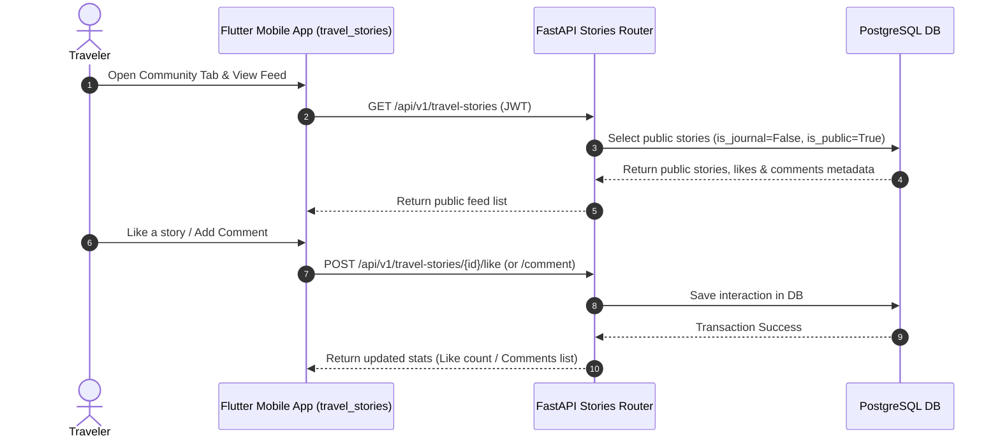

### 7. Travel Journaling & Personal Log (`travel_stories` / private)
*   **Overview**: A personal digital journal where travelers record their travel check-ins, upload trip memories, and log local coordinates. Users can toggle entries as private (which hides them from the public community feed).
*   **API Endpoints**:
    *   `POST /api/v1/travel-stories`: Save a new journal/story entry.
        *   *Headers*: `Authorization: Bearer <JWT_ACCESS_TOKEN>`
        *   *Request*: `TravelStoryCreate` JSON containing `location_name`, `description`, `image_urls`, `latitude`, `longitude`, `is_journal` (boolean), `is_public` (boolean), `journal_date`.
        *   *Response*: `TravelStoryResponse` confirming details of the saved entry.
    *   `GET /api/v1/travel-stories/journal`: Fetch user's private journals.
        *   *Headers*: `Authorization: Bearer <JWT_ACCESS_TOKEN>`
        *   *Response*: Array of private `TravelStoryResponse` items sorted chronologically by date.
*   **API Keys & External Services Used**:
    *   **Geoapify API Key (`geoapify_api_key`)**: Used by the backend proxy to reverse-geocode latitude and longitude parameters into human-readable locations (e.g. city name, country) during journal creation. If the Geoapify API key is unavailable, the backend falls back to Mapbox's geocoding engine using the `mapbox_access_token`.

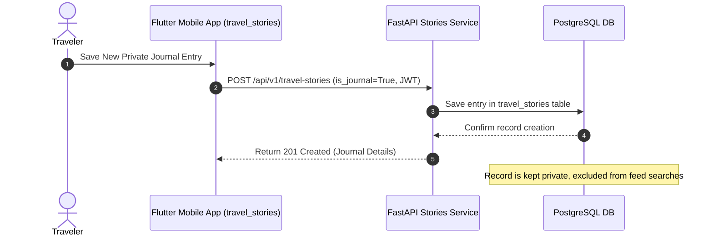

### 8. Budget Tracker & Expense Logging (`budget`)
*   **Overview**: Helps travelers keep track of their target budgets, log expenses in various categories (Food, Transit, Lodging), and handle real-time currency conversion back to the budget's base currency.
*   **API Endpoints**:
    *   `GET /api/v1/budget/`: Retrieve the traveler's active budget details and calculated expense breakdowns.
        *   *Headers*: `Authorization: Bearer <JWT_ACCESS_TOKEN>`
        *   *Response*: `Budget` schema containing total amount, base currency, list of logged expenses, and remaining budget metrics.
    *   `POST /api/v1/budget/`: Initialize a new trip budget (automatically closes any active past budgets).
        *   *Headers*: `Authorization: Bearer <JWT_ACCESS_TOKEN>`
        *   *Request*: `BudgetCreate` JSON with `name`, `total_amount`, `currency`, `start_date`, `end_date`.
        *   *Response*: The created `Budget` instance.
    *   `POST /api/v1/budget/expense`: Log a new cost against the active budget.
        *   *Headers*: `Authorization: Bearer <JWT_ACCESS_TOKEN>`
        *   *Request*: `ExpenseCreate` JSON containing `budget_id`, `amount`, `category`, `description`, `spent_at`, and `currency`.
        *   *Response*: `Expense` confirmation, detailing standard conversion values.
*   **API Keys & External Services Used**: None (conversion rates are resolved internally using cached static multipliers; no live external financial APIs are bound).

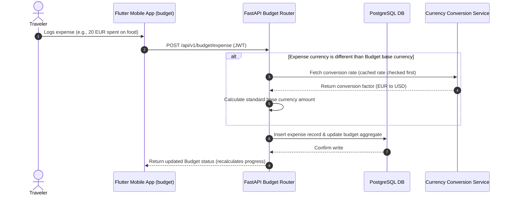

### 9. Neva AI Chat Companion (`ai_companion`)
*   **Overview**: Provides the user with "Neva", a witty, location-aware travel companion capable of answering questions about history, translation, and local secrets.
*   **API Endpoints**:
    *   `POST /api/v1/message`: Send prompt to Neva.
        *   *Headers*: `Authorization: Bearer <JWT_ACCESS_TOKEN>`
        *   *Request*: `ChatRequest` JSON containing `message` and `context` (such as active latitude/longitude coordinate bounds or current country).
        *   *Response*: `ChatResponse` JSON containing Neva's formatted response.
*   **API Keys & External Services Used**:
    *   **Google Gemini API Key (`gemini_api_key`)**: Proxied by the backend through `/proxy/gemini/generate` to interact with Gemini generative models (`gemini-2.5-flash`), keeping the API key hidden from the client mobile binary.

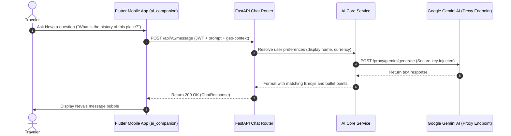

### 10. Interactive Food Radar (`food_radar`)
*   **Overview**: Pulls localized, context-aware trending experiences, attractions, and restaurant lists based on geographic coordinates, local weather, and popular demand.
*   **API Endpoints**:
    *   `GET /api/v1/places/trending`: Retrieve trending local events and dining recommendations.
        *   *Request Params*: `district` (string), `lat` (float), `lng` (float).
        *   *Response*: `TrendingExperiencesResponse` containing curated events, restaurants, and nature spots generated by Gemini and cross-referenced with Google Places coordinates.
*   **API Keys & External Services Used**:
    *   **Google Maps API Key (`google_maps_api_key`)**: Used by the backend proxy to fetch nearby Places coordinates and reviews.
    *   **Google Gemini API Key (`gemini_api_key`)**: Used by the backend to filter, verify, and generate weather-tailored dining recommendation cards.

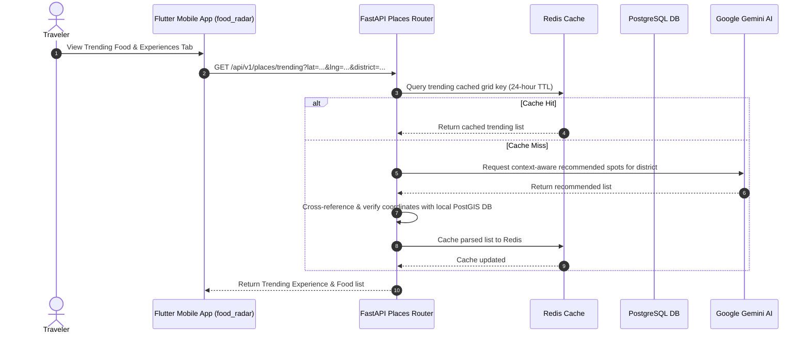

---

## 📡 6. Legacy Endpoints & System Reference Summary

The server communicates via standard JSON REST endpoints over HTTPS.

*   `POST /api/v1/auth/register`: Creates new user account.
*   `POST /api/v1/auth/login`: Authenticates credentials and returns a secure JWT token.
*   `GET /api/v1/auth/me`: Fetches active user preferences.
*   `GET /api/v1/places/nearby`: Fetches category-specific attractions within a spatial bounding box or radius.
*   `GET /api/v1/places/trending`: Requests context-aware AI recommendations (e.g., nature spots based on weather).
*   `POST /api/v1/proxy/gemini/generate`: Proxies chat interactions with Gemini, hiding secret keys on the VPS.
*   `POST /api/v1/travel-stories`: Submits stories/journal entries with photo references.

---

## 🛠️ 7. CI/CD & Build Pipeline (GitHub Actions)

NexAround uses automated **GitHub Actions** workflows to build client releases:

### Android APK Build (`build_apk.yml`)
Triggers on any commit to the `main` branch affecting the `nexaround_app/` folder.
*   **Environment**: Installs **Ubuntu-latest**, sets up **Java 17 (Zulu)**, and installs the stable **Flutter SDK**.
*   **Signing Setup**: Decodes the base64 keystore upload credentials stored in GitHub secrets into `upload-keystore.jks` and writes local `key.properties`.
*   **Compilation**:
    *   `flutter build apk --split-per-abi` (Creates architecture-optimized `.apk` files).
    *   `flutter build appbundle` (Creates `.aab` production file for the Google Play Store).
*   **Artifacts**: Uploads built files to GitHub artifacts for direct team testing.

---

## 🛡️ 8. Security, Cost Optimization, & Caching

Because external APIs (Google Places and Gemini GenAI) charge per query, the platform implements custom caching and protection layers:

### 8.1 External API Key Management & Mapping Registry
To protect intellectual property and manage system costs, all external API keys are secured server-side. The following registry outlines the configuration variables, provider systems, and features supported by each key:

| Environment Variable / Config Key | External Provider | Scope & Purpose | Associated Feature Modules |
| :--- | :--- | :--- | :--- |
| `google_maps_api_key` | Google Cloud Console | Authorizes Places API, Place Photo API, and client Maps SDKs. | `living_map`, `food_radar` |
| `mapbox_access_token` | Mapbox | Loads premium vector maps styling and routes directions. | `living_map` |
| `gemini_api_key` | Google AI Studio | Generates trip itineraries, Neva companion chats, and processes AR frames. | `itinerary`, `ar_mode`, `ai_companion`, `food_radar` |
| `geoapify_api_key` | Geoapify | Reverse-geocodes coordinate parameters to locate journal locations. | `travel_stories` (Journal Mode) |

### 8.2 Security Protocols
1.  **API Key Protection (Secure Proxying)**:
    The mobile app never interacts directly with Google Maps or Gemini endpoints, meaning API keys are never stored in the compiled binary. Instead, the mobile client calls the backend proxy, which attaches keys securely at the server-level before sending the request.
2.  **Coordinates Snapped-Grid Cache (Redis)**:
    When querying places near a coordinate, the server snaps coordinates onto a predefined coordinate grid and checks **Redis**. If cached places exist for that grid tile, the backend serves them instantly. This reduces external Google Maps queries by up to **80%**.
3.  **Spam & Noise Filtering**:
    For lists like the **Nature** section, the backend runs queries through verification pipelines. It excludes residential listings, vacation stays, or apartments (by parsing names for keywords like `homestay`, `bedroom`, `apartment`, `villa`) and drops places without reviews to keep lists clean.
4.  **Token Handshake**:
    App-to-server calls are validated using **JWT** tokens containing encrypted user IDs, keeping endpoints safe from outside crawler bots.

---

## 🏗️ 9. VPS Infrastructure & Deployment Specs

The backend architecture is deployed on a VPS running **Docker Compose** behind an **Nginx Reverse Proxy**.

```
                  ┌───────────────────────────────────────────────┐
                  │                   VPS Host                    │
                  │                                               │
                  │               ┌───────────────┐               │
  HTTPS (443) ───┼──────────────►│ Nginx Reverse │               │
                  │               │     Proxy     │               │
                  │               └───────┬───────┘               │
                  │                       │                       │
                  │                       ▼ (Docker Bridge Network)
                  │             ┌──────────────────┐              │
                  │             │   Compose Pod    │              │
                  │             │                  │              │
                  │             │   ┌──────────┐   │              │
                  │             │   │  api:    │   │              │
                  │             │   │  Port    │   │              │
                  │             │   │  8000    │   │              │
                  │             │   └────┬───┬─┘   │              │
                  │             │        │   │     │              │
                  │             │        ▼   ▼     │              │
                  │             │    ┌───┴─┐ ┌─┴───┐              │
                  │             │    │ db: │ │redis│              │
                  │             │    └─────┘ └─────┘              │
                  │             └──────────────────┘              │
                  └───────────────────────────────────────────────┘
```

*   **Nginx Proxy (Host level)**: Listens on port `443` (SSL encrypted using Let's Encrypt certificates) and routes traffic internally to the docker bridge network.
*   **Docker Container Ports**:
    *   **`api` (FastAPI)**: Runs inside the bridge network on port `8000` (mapped externally to `8010` for management).
    *   **`db` (PostgreSQL/PostGIS)**: Listens internally on port `5432`. Access is strictly bound to the local docker network and locked out of public ports.
    *   **`redis` (Cache)**: Listens on port `6379`. Only visible internally to the `api` container.
*   **Logging**: Container logs are formatted as raw stream files and limited to `max-size: 10m` to optimize server disk usage.

---

## 📸 10. Screen Tour & Visual Walkthrough

Here is a visual breakdown of the key user interfaces in NexAround, highlighting the latest design adjustments:

### 1. New Journal Entry (With Close Button)
The journal entry panel is designed as a smooth bottom drawer. It now includes a clear close button (`X`) at the top right header to allow travelers to dismiss the drawer gracefully.

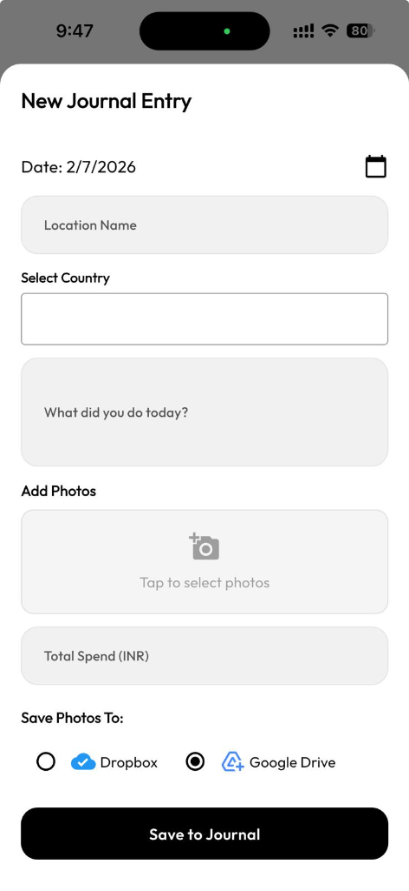

### 2. Redesigned Category Panels
To keep the design clean and consistent across the app:
*   **Nature Tab**: Displays the newly added nature spots (e.g. beaches, national parks, waterfalls) with small, elegant, horizontally scrollable category tags.
*   **Food & Medical Tabs**: Rather than being pushed left or taking up massive screen space with a radar sweep, the small category icons are beautifully centered as a horizontal group on the page.

| Tab Category | Redesigned User Interface |
| :--- | :--- |
| **Nature Tab** | 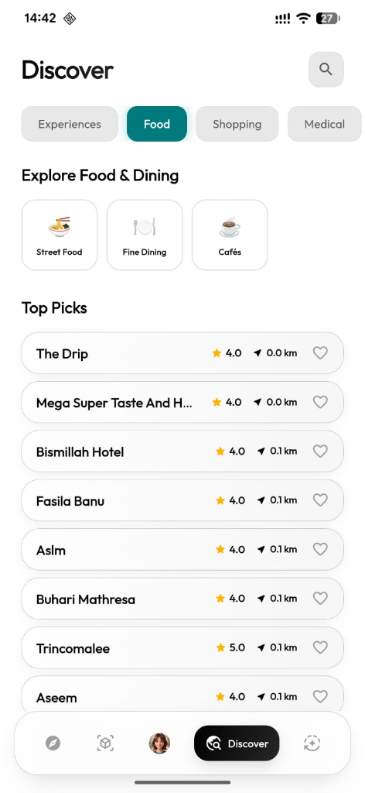 |
| **Food Tab** | 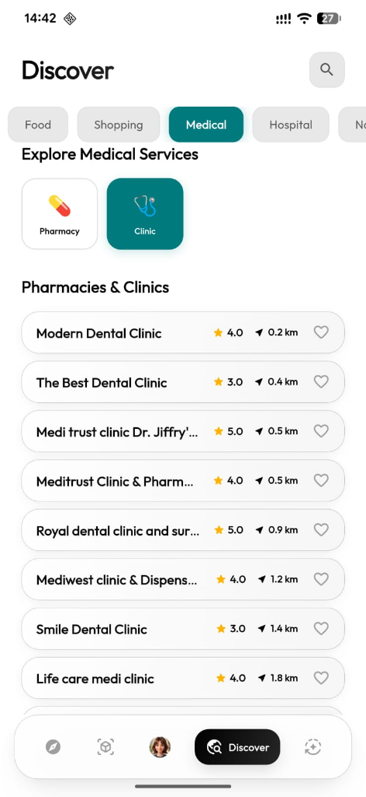 |
| **Medical Tab** | 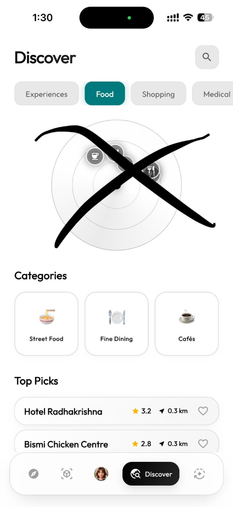 |
