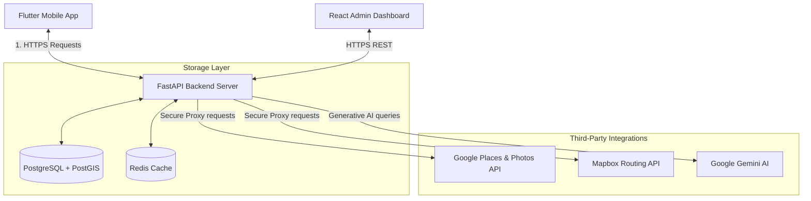

# NexAround — Complete Platform Architecture & System Specifications

This document serves as the master authority on the architecture, technical specs, database schemas, and deployment setup for the **NexAround** smart tourism platform. It is designed to be accessible to project managers, business stakeholders, and developers alike.

---

## 🗺️ 1. High-Level Architectural Flow

NexAround uses a client-server architecture. To prevent resource abuse and secure third-party API keys, all client devices speak only with a central server, which queries external APIs (like Gemini AI, Google Maps, and Mapbox) securely and caches expensive search queries.

### Visual Architecture Diagram


### System Component Handshake (Mermaid Diagram)


---

## 📱 2. Mobile Client Architecture (`nexaround_app`)

The mobile client is built using **Flutter (Dart)** and follows **Clean Architecture** patterns combined with the **BLoC** (Business Logic Component) state management pattern.

```
          ┌─────────────────────────────────────────────────────────┐
          │                   Presentation Layer                    │
          │         [Widgets / UI Pages] ◄──► [BLoCs / States]      │
          └────────────────────────────┬────────────────────────────┘
                                       │
                                       ▼
          ┌─────────────────────────────────────────────────────────┐
          │                      Domain Layer                       │
          │    [Entities] ◄── [Use Cases] ◄── [Repository Interface]│
          └────────────────────────────┬────────────────────────────┘
                                       │
                                       ▼
          ┌─────────────────────────────────────────────────────────┐
          │                       Data Layer                        │
          │   [Models] ◄── [Repository Impl] ◄── [Datasources]       │
          └─────────────────────────────────────────────────────────┘
```

### Module File Layout
Each app feature (e.g., `living_map`, `auth`, `attractions`, `budget`) is split into three independent layers:
*   **Domain Layer**:
    *   **Entities**: Pure Dart model classes defining the core data model.
    *   **Use Cases**: Handles feature-specific workflows (e.g., `fetch_nearby_places_usecase`).
    *   **Repository Interfaces**: Abstract contracts defining required operations.
*   **Data Layer**:
    *   **Models**: Extends entities to provide serialization/deserialization helpers (`fromJson`, `toJson`).
    *   **Repository Implementations**: Fulfills the domain repository contract by coordinating network calls.
    *   **Datasources**: Handles low-level I/O operations (e.g., REST API calls via Dio, local storage using SharedPreferences).
*   **Presentation Layer**:
    *   **BLoCs**: Manages business logic and updates the view by mapping incoming `Events` to new `States`.
    *   **Pages & Widgets**: Renders the UI and triggers `Events` when users interact with the screen.

### Dependency Stack
*   **State Management**: `flutter_bloc`
*   **Navigation / Routing**: `go_router`
*   **Network Client**: `dio` (with global retry, SSL pinning, and API interceptors)
*   **Dependency Injection**: `get_it` & `injectable`

---

## ⚡ 3. Backend Service Architecture (`nexaround_backend`)

The backend is built with **FastAPI (Python)**. It acts as an API gateway, secure key proxy, database coordinator, and geospatial query engine.

### Code Organization
*   **`app/api/`**: API endpoint routers grouped under `/v1` (e.g., `auth.py`, `places.py`, `proxy.py`).
*   **`app/services/`**: Houses the core logic for Google Places geocoding, Gemini AI formatting, map indexing, and currency converters.
*   **`app/models/`**: Defines SQLAlchemy database tables mapping Python objects to PostgreSQL.
*   **`app/schemas/`**: Pydantic validation schemas defining incoming payload requirements and outgoing serialization models.
*   **`app/core/`**: Configuration, database pooling (`async_session`), security headers, and settings.

### Technology Stack
*   **Framework**: FastAPI & Uvicorn (Asynchronous ASGI server).
*   **Database Interface**: SQLAlchemy with dynamic async support (`asyncpg`) and **GeoAlchemy2** for PostGIS coordinate operations.
*   **Caching**: Redis (manages coordinate-based grids and keeps resolved maps in memory with custom TTL expirations).
*   **AI Integration**: Official Google GenAI SDK (Gemini-2.5-flash & Gemini-1.5-flash models).

---

## 🗄️ 4. Database Schema (PostgreSQL + PostGIS)

The PostgreSQL database uses PostGIS to perform spatial querying (such as checking if an attraction falls inside a traveler's geofence or finding spots within a 15km radius).

### Primary Database Models

#### User Model (`users`)
Stores profile preferences and authentication hashes.
*   `id`: `UUID` (Primary Key)
*   `email`: `VARCHAR(255)` (Unique, Indexed)
*   `password_hash`: `VARCHAR(255)` (Hashed via bcrypt)
*   `display_name`: `VARCHAR(100)`
*   `preferences`: `JSON` (Holds user preferences like `{"currency": "USD"}`)
*   `language`: `VARCHAR(10)` (Default: `"en"`)
*   `is_active`: `BOOLEAN`
*   `created_at`: `TIMESTAMP(timezone=True)`

#### Attraction Model (`attractions`)
Stores physical discovery points mapped by PostGIS.
*   `id`: `UUID` (Primary Key)
*   `name`: `VARCHAR(255)` (Indexed)
*   `description` / `history`: `TEXT`
*   `location`: `Geometry(POINT, 4326)` (PostGIS spatial point mapping lat/lng coordinates)
*   `category_id`: `UUID` (Foreign Key referencing `categories.id`)
*   `address`: `VARCHAR(500)`
*   `rating` / `review_count`: `FLOAT` / `INTEGER`
*   `photo_urls` / `tags`: `ARRAY(VARCHAR)`
*   `geofence_radius_m`: `INTEGER` (Default: `100`)
*   `is_active`: `BOOLEAN`

#### Budget Model (`budgets` & `expenses`)
Tracks user budgets and daily travel expenses.
*   **`budgets`**:
    *   `id`: `UUID` (Primary Key)
    *   `user_id`: `UUID` (Foreign Key referencing `users.id`)
    *   `name`: `VARCHAR(100)`
    *   `total_amount`: `FLOAT`
    *   `currency`: `VARCHAR(10)`
    *   `start_date` / `end_date`: `DATE`
*   **`expenses`**:
    *   `id`: `UUID` (Primary Key)
    *   `budget_id`: `UUID` (Foreign Key referencing `budgets.id` with cascade delete)
    *   `amount`: `FLOAT`
    *   `category`: `VARCHAR(50)` (e.g., Food, Travel, Tickets)
    *   `description`: `VARCHAR(255)`
    *   `spent_at`: `TIMESTAMP`

#### Travel Story & Journal Model (`travel_stories`)
Stores social travel check-ins and personal private journal notes.
*   `id`: `UUID` (Primary Key)
*   `user_id`: `UUID` (Foreign Key referencing `users.id`)
*   `location_name`: `VARCHAR(255)`
*   `description`: `VARCHAR(1000)`
*   `image_urls`: `ARRAY(VARCHAR)`
*   `latitude` / `longitude`: `FLOAT`
*   `is_journal`: `BOOLEAN` (If `true`, hides the post from public feeds)
*   `journal_date`: `TIMESTAMP`
*   `total_spend`: `FLOAT`
*   `spend_currency`: `VARCHAR(10)`

---

## 📡 5. API Reference Summary

The server communicates via standard JSON REST endpoints over HTTPS.

*   `POST /api/v1/auth/register`: Creates new user account.
*   `POST /api/v1/auth/login`: Authenticates credentials and returns a secure JWT token.
*   `GET /api/v1/auth/me`: Fetches active user preferences.
*   `GET /api/v1/places/nearby`: Fetches category-specific attractions within a spatial bounding box or radius.
*   `GET /api/v1/places/trending`: Requests context-aware AI recommendations (e.g., nature spots based on weather).
*   `POST /api/v1/proxy/gemini/generate`: Proxies chat interactions with Gemini, hiding secret keys on the VPS.
*   `POST /api/v1/travel-stories`: Submits stories/journal entries with photo references.

---

## 🛠️ 6. CI/CD & Build Pipeline (GitHub Actions)

NexAround uses automated **GitHub Actions** workflows to build client releases:

### Android APK Build (`build_apk.yml`)
Triggers on any commit to the `main` branch affecting the `nexaround_app/` folder.
*   **Environment**: Installs **Ubuntu-latest**, sets up **Java 17 (Zulu)**, and installs the stable **Flutter SDK**.
*   **Signing Setup**: Decodes the base64 keystore upload credentials stored in GitHub secrets into `upload-keystore.jks` and writes local `key.properties`.
*   **Compilation**:
    *   `flutter build apk --split-per-abi` (Creates architecture-optimized `.apk` files).
    *   `flutter build appbundle` (Creates `.aab` production file for the Google Play Store).
*   **Artifacts**: Uploads built files to GitHub artifacts for direct team testing.

---

## 🛡️ 7. Security, Cost Optimization, & Caching

Because external APIs (Google Places and Gemini GenAI) charge per query, the platform implements custom caching and protection layers:

1.  **API Key Protection (Secure Proxying)**:
    The mobile app never interacts directly with Google Maps or Gemini endpoints, meaning API keys are never stored in the compiled binary. Instead, the mobile client calls the backend proxy, which attaches keys securely at the server-level before sending the request.
2.  **Coordinates Snapped-Grid Cache (Redis)**:
    When querying places near a coordinate, the server snaps coordinates onto a predefined coordinate grid and checks **Redis**. If cached places exist for that grid tile, the backend serves them instantly. This reduces external Google Maps queries by up to **80%**.
3.  **Spam & Noise Filtering**:
    For lists like the **Nature** section, the backend runs queries through verification pipelines. It excludes residential listings, vacation stays, or apartments (by parsing names for keywords like `homestay`, `bedroom`, `apartment`, `villa`) and drops places without reviews to keep lists clean.
4.  **Token Handshake**:
    App-to-server calls are validated using **JWT** tokens containing encrypted user IDs, keeping endpoints safe from outside crawler bots.

---

## 🏗️ 8. VPS Infrastructure & Deployment Specs

The backend architecture is deployed on a VPS running **Docker Compose** behind an **Nginx Reverse Proxy**.

```
                  ┌───────────────────────────────────────────────┐
                  │                   VPS Host                    │
                  │                                               │
                  │               ┌───────────────┐               │
  HTTPS (443) ───┼──────────────►│ Nginx Reverse │               │
                  │               │     Proxy     │               │
                  │               └───────┬───────┘               │
                  │                       │                       │
                  │                       ▼ (Docker Bridge Network)
                  │             ┌──────────────────┐              │
                  │             │   Compose Pod    │              │
                  │             │                  │              │
                  │             │   ┌──────────┐   │              │
                  │             │   │  api:    │   │              │
                  │             │   │  Port    │   │              │
                  │             │   │  8000    │   │              │
                  │             │   └────┬───┬─┘   │              │
                  │             │        │   │     │              │
                  │             │        ▼   ▼     │              │
                  │             │    ┌───┴─┐ ┌─┴───┐              │
                  │             │    │ db: │ │redis│              │
                  │             │    └─────┘ └─────┘              │
                  │             └──────────────────┘              │
                  └───────────────────────────────────────────────┘
```

*   **Nginx Proxy (Host level)**: Listens on port `443` (SSL encrypted using Let's Encrypt certificates) and routes traffic internally to the docker bridge network.
*   **Docker Container Ports**:
    *   **`api` (FastAPI)**: Runs inside the bridge network on port `8000` (mapped externally to `8010` for management).
    *   **`db` (PostgreSQL/PostGIS)**: Listens internally on port `5432`. Access is strictly bound to the local docker network and locked out of public ports.
    *   **`redis` (Cache)**: Listens on port `6379`. Only visible internally to the `api` container.
*   **Logging**: Container logs are formatted as raw stream files and limited to `max-size: 10m` to optimize server disk usage.

---

## 📸 9. Screen Tour & Visual Walkthrough

Here is a visual breakdown of the key user interfaces in NexAround, highlighting the latest design adjustments:

### 1. New Journal Entry (With Close Button)
The journal entry panel is designed as a smooth bottom drawer. It now includes a clear close button (`X`) at the top right header to allow travelers to dismiss the drawer gracefully.


### 2. Redesigned Category Panels
To keep the design clean and consistent across the app:
*   **Nature Tab**: Displays the newly added nature spots (e.g. beaches, national parks, waterfalls) with small, elegant, horizontally scrollable category tags.
*   **Food & Medical Tabs**: Rather than being pushed left or taking up massive screen space with a radar sweep, the small category icons are beautifully centered as a horizontal group on the page.

| Tab Category | Redesigned User Interface |
| :--- | :--- |
| **Nature Tab** |  |
| **Food Tab** |  |
| **Medical Tab** |  |
